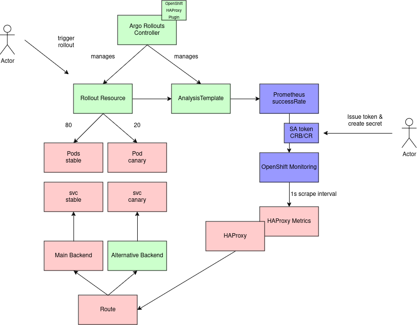
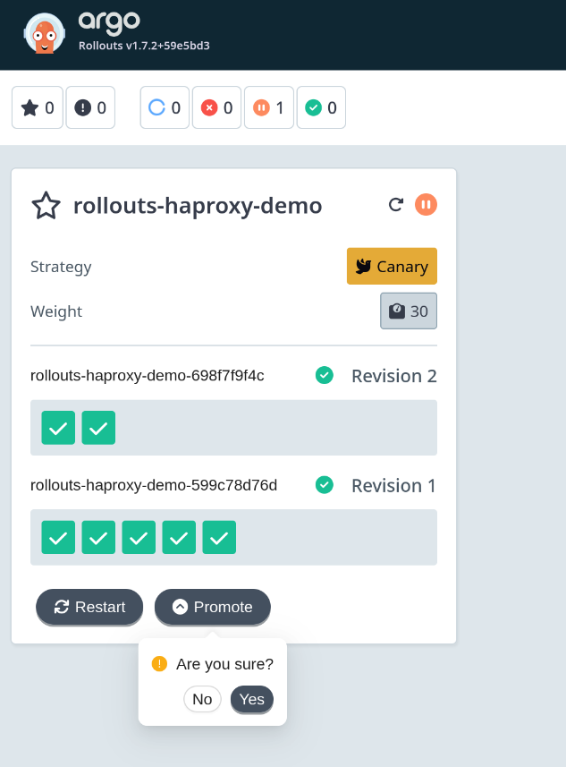
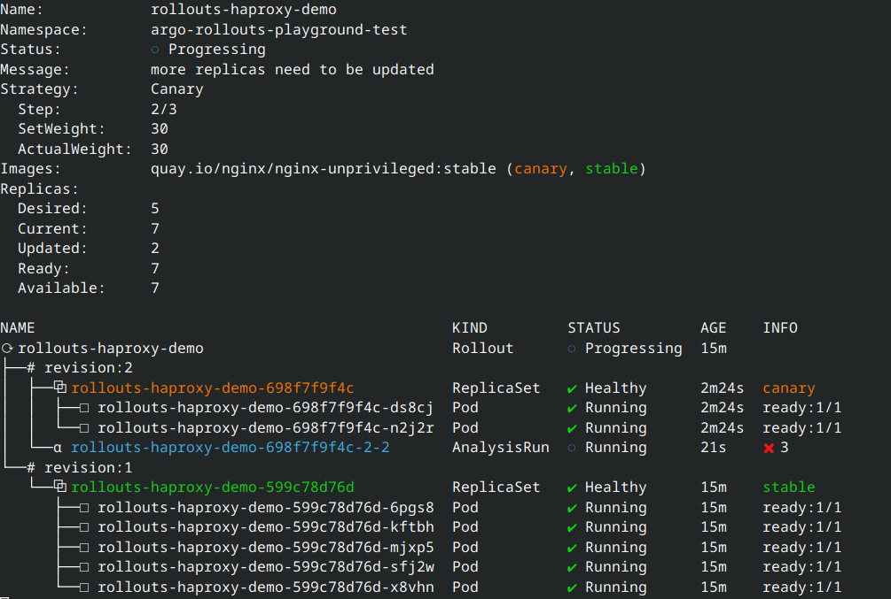

# kikkers

Argo Events playground (Code Camp 2024)

## MinIO Use Case


### Setup

#### Deploy MinIO instance

* Expose minio and minio-console svc
* Add generated ca to destinationCA in Routes
* Define MINIO_ROOT_USER and MINIO_ROOT_PASSWORD storage-configuration config.env
* [tenant](https://github.com/baloise-incubator/code-camp-apps/blob/master/argo-events-playground-test/minio-tenant.yaml)
* Create bucket with name `test` and generate Access and Secret Keys

Create [native NATs eventbus](https://github.com/baloise-incubator/code-camp-apps/blob/master/argo-events-playground-test/kustomization.yaml#L9)

* Stan(NATS Streaming / deprecated), Jetstream (NATS JetStream) and Kafka
  * [Stan: create 3 replicas with token authentication (stan)](https://argoproj.github.io/argo-events/eventbus/stan/)
  * [Jetstream: create 3 replicas with /set password authentication (TLS is turned on, the password is encrypted)](https://argoproj.github.io/argo-events/eventbus/jetstream/)
  * [When using a Kafka EventBus you must already have a Kafka cluster set up](https://argoproj.github.io/argo-events/eventbus/kafka/)
* token strategy will generate a token and store it in K8s secrets (one for client, one for server), EventSource and Sensor automatically use the secret
* EventBus is namespaced; an EventBus object is required in a namespace to make EventSource and Sensor work.
* EventBus named default
* Stan
  * Max Age of existing messages (defaults to 72h)
  * Max number of messages before expiring the oldest messages (Defaults to 1000000)
  * Total size of messages before expiring the oldest messages (Defaults to 1GB)
  * Maximum number of subscriptions (Defaults to 1000)
  * Maximum number of bytes in a message payload (Defaults to 1MB)
  * https://argoproj.github.io/argo-events/eventbus/stan/#more-about-native-nats-eventbus

#### Create RBAC needed to run workflows

* [sensor-rbac.yaml](https://github.com/baloise-incubator/code-camp-apps/blob/master/argo-events-playground-test/sensor-rbac.yaml)
* [workflow-rbac.yaml](https://github.com/baloise-incubator/code-camp-apps/blob/master/argo-events-playground-test/workflow-rbac.yaml)

#### Create EventSource

* [eventsource.yaml](https://github.com/baloise-incubator/code-camp-apps/blob/master/argo-events-playground-test/eventsource.yaml)
* Watch for `s3:ObjectCreated:Put` in bucket `test` using Access and Secret Keys provided in `artifacts-minio` secret and create `sudoku` event
* Filter to `prefix: "input"` and `suffix: ".txt"`
* Point to Route to trust certificate (Route re-encrypt using MinIO destination certificate)

#### Create Sensor

* [sensor.yaml](https://github.com/baloise-incubator/code-camp-apps/blob/master/argo-events-playground-test/sensor.yaml)
* Create workflow that References a workflowTemplate as soon as event is created on the eventbus
* Reference event `sudoku` event from eventSource `minio`
* test-dep provide metadata from event to parameters to the created workflow
* Argo Sensor k8s trigger create Argo Workflow resource
  * Created Argo Workflows resource references Argo Workflow Template
* use event metadata to provide path to local s3 downloaded file

#### Create workflowTemplate

* [sudoku-wft.yaml](https://github.com/baloise-incubator/code-camp-apps/blob/master/argo-events-playground-test/sudoku-wft.yaml)
* s3 input (get files from MinIO using Access and Secret Keys provided in `artifacts-minio` secret)
* s3 output (put files to MinIO using Access and Secret Keys provided in `artifacts-minio` secret)
* set archive to {} to keep plain files when put to s3
* ghcr.io/luechtdiode/sudoku:0.0.2 [Sudoku Solver Repo](https://github.com/luechtdiode/sudoku)


#### Make use of extended hanlding of event-metadata

Capture more context-data from Minio Sudoku Event and try to identify Sudoku File Uploader for further notification purposes
  
Sample Event Payload (see pricipalId: Sudoku Requester):
```json
[{
  eventVersion:2.0,
  eventSource:minio:s3,
  awsRegion:,
  eventTime:2024-10-30T13:02:09.050Z,
  eventName:s3:ObjectCreated:Put,
  userIdentity:{
    principalId:Sudoku Requester
  },
  requestParameters:{
    principalId:Sudoku Requester,
    region:,
    sourceIPAddress:redacted minio host ip
  },
  responseElements:{
    x-amz-id-2:912a0631cecf761f73c7401d71bc819e9fd4b007e66fba8f36cc12235413475e,
    x-amz-request-id:18033C9D81E3DDB9,
    x-minio-deployment-id:358cb810-c0cc-4d30-9e86-e5bfbdf8cd0f,
    x-minio-origin-endpoint:https://minio.redacted.svc.cluster.local
  },
  s3:{
    s3SchemaVersion:1.0,
    configurationId:Config,
    bucket:{
      name:test,
      ownerIdentity:{
        principalId:Sudoku Requester
      },
      arn:arn:aws:s3:::test
    },
    object:{
      key:input/sudoku.txt,
      size:2591,
      eTag:5824476e697ce635d1eae18057131aab,contentType:text/plain,
      userMetadata:{content-type:text/plain},
      sequencer:18033C9D81FB2313
    }
  },
  source:{
    host:redacted minio host ip,
    port:,
    userAgent:MinIO (linux; amd64) minio-go/v7.0.70 MinIO Console/(dev)
  }
}]
```

Use username of file-uploader to define outputfolder. See separate [workflow-implmentation](https://github.com/luechtdiode/mk8-argo/tree/mk8-128/argo-events-playground-test)

## Argo Rollouts

* Application need to be able to scale horizontally (more than one replica possible to run at the same time)




* Deploy using OLM, as OpenShift [Argo Rollout plugin](https://argo-rollouts.readthedocs.io/en/stable/plugins/) is needed for HAProxy traffic-splitting/routing integration on Argo Rollout Controller deployment.

```yaml
      trafficRouting:
        plugins:
          argoproj-labs/openshift:
            routes:
              - ...
```

Ignore weight in ArgoCD

```bash
  resource.customizations: |
    route.openshift.io/Route:
      ignoreDifferences: |
        jsonPointers:
        - /spec/to/weight
        jqPathExpressions:
        - '.spec.alternateBackends[]?.weight'
```

<https://docs.openshift.com/gitops/1.14/argo_rollouts/routing-traffic-by-using-argo-rollouts.html>

### Setup

Rollout

* [Stable Service](https://github.com/baloise-incubator/code-camp-apps/blob/master/argo-rollouts-playground-test/haproxy-stable-svc.yaml)
* [Canary Service](https://github.com/baloise-incubator/code-camp-apps/blob/master/argo-rollouts-playground-test/haproxy-canary-svc.yaml)
* [Route](https://github.com/baloise-incubator/code-camp-apps/blob/master/argo-rollouts-playground-test/haproxy-route.yaml)
  * Define alternateBackends to point to canary service using weight managed by Argo Rollouts
* [Rollout Resource](https://github.com/baloise-incubator/code-camp-apps/blob/master/argo-rollouts-playground-test/haproxy-rollout.yaml)
  * Defines Pod spec
  * Differs from deployment in strategy section
    * Split traffic between canary service and stable service using the alternateBackends defintion in Route
    * Use OpenShift traffic routing plugin
    * Add Criteria in steps to proceed with rollouts using an AnalysisTemplate
    * Pass route name to rerfence it in HAproxy metrics in analysis

Analysis

* [AnalysisTemplate](https://github.com/baloise-incubator/code-camp-apps/blob/master/argo-rollouts-playground-test/haproxy-analysistemplate.yaml)
  * Use success rate of request to rollout or rollback
    * Run analysis every 10s / 10 times
    * failureLimit: 3 # Fixme
    * success rate above 90% required to proceed
    * Use OpenShift Monitoring provided metrics `haproxy_backend_http_responses_total`
    * Authenticate using serviceAccount against Thanos Querier API

Provide openshift-monitoring metrics (Do not use this in producation!)

* [ServiceMonitor](https://github.com/baloise-incubator/code-camp-apps/blob/master/argo-rollouts-playground-test/servicemonitor.yaml)
  * For demonstation purpose only. Do not add serviceMonitors to RH provided openshift-monitoring stack
  * Make sure you have 1s scrape interval
* [Thanos Querier SA](https://github.com/baloise-incubator/code-camp-apps/blob/master/argo-rollouts-playground-test/haproxy-thanos-querier-reader-sa.yaml)
  * Provide SA that can access openshift-monitoring using a bearer token
* [Thanos Querier CRB](https://github.com/baloise-incubator/code-camp-apps/blob/master/argo-rollouts-playground-test/haproxy-thanos-querier-reader-crb.yaml)
  * openshift-monitoring uses oauth proxy / openshift-delegate-urls to gran access to serviceAccounts that can `get` `namespace`


Create short-live token for Demo

```bash
TOKEN=$(kubectl create token thanos-querier-reader --namespace argo-rollouts-playground-test --duration 6000m)
kubectl create secret generic token --from-literal=token="Bearer $TOKEN"
```

### Trivial Demo

Create some requests

```bash
kubectl delete rollout rollouts-haproxy-demo
while true; do sleep 0.1 && curl https://rollouts-demo-route-argo-rollouts-playground-test.apps.baloise.dev -I; done
```

[Metrics](https://console.baloise.dev/monitoring/query-browser?query0=sum%28%0A++++++++++++rate%28%0A++++++++++++++haproxy_backend_http_responses_total%7Broute%3D%22rollouts-demo-route%22%2Ccode%21%7E%22%5B4-5%5D.*%22%7D%5B10s%5D%0A++++++++++++%29%0A++++++++++%29%0A++++++++++%2F%0A++++++++++sum%28%0A++++++++++++rate%28%0A++++++++++++++haproxy_backend_http_responses_total%7Broute%3D%22rollouts-demo-route%22%7D%5B10s%5D%0A++++++++++++%29%0A++++++++++%29)

Generate some 403

```bash
        volumeMounts:
        - mountPath: /usr/share/nginx/html
          name: nginx
```

Start Dashboard
```bash
kubectl argo rollouts dashboard
```



Start TUI

```bash
kubectl argo rollouts get rollout rollouts-haproxy-demo --watch
```



Proceed with rollout

```bash
kubectl argo rollouts promote rollouts-haproxy-demo 

kubectl get analysisruns.argoproj.io
```
