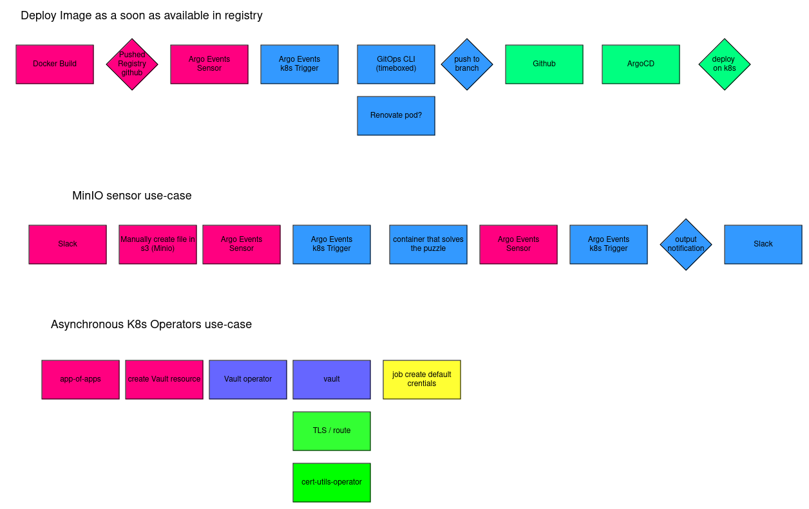
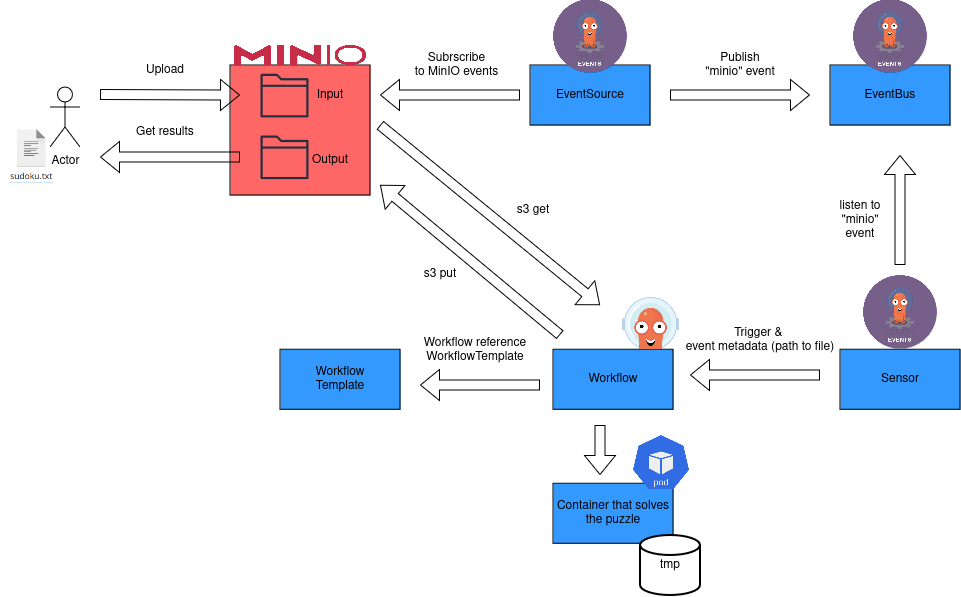

# kikkers

Argo Events playground (Code Camp 2024)

## MinIO Use Case

Deploy MinIO instance

* Expose minio and minio-console svc
* Add generated ca to destinationCA in Routes
* Define MINIO_ROOT_USER and MINIO_ROOT_PASSWORD storage-configuration config.env
* [tenant](https://github.com/baloise-incubator/code-camp-apps/blob/master/argo-events-playground-test/minio-tenant.yaml)
* Create bucket with name `test` and generate Access and Secret Keys

Create [native NATs eventbus](https://github.com/baloise-incubator/code-camp-apps/blob/master/argo-events-playground-test/kustomization.yaml#L9)
* Stan(NATS Streaming / deprecated), Jetstream (NATS JetStream) and Kafka
* create 3 replicas with token authentication
* token strategy will generate a token and store it in K8s secrets (one for client, one for server), EventSource and Sensor automatically use the secret
* EventBus is namespaced; an EventBus object is required in a namespace to make EventSource and Sensor work.
* EventBus named default
* Stan
  * Max Age of existing messages (defaults to 72h)
  * Max number of messages before expiring the oldest messages (Defaults to 1000000)
  * Total size of messages before expiring the oldest messages (Defaults to 1GB)
  * Maximum number of subscriptions (Defaults to 1000)
  * Maximum number of bytes in a message payload (Defaults to 1MB)
  * https://argoproj.github.io/argo-events/eventbus/stan/#more-about-native-nats-eventbus

Create RBAC needed to run workflows
* [sensor-rbac.yaml](https://github.com/baloise-incubator/code-camp-apps/blob/master/argo-events-playground-test/sensor-rbac.yaml)
* [workflow-rbac.yaml](https://github.com/baloise-incubator/code-camp-apps/blob/master/argo-events-playground-test/workflow-rbac.yaml)

Create EventSource
* [eventsource.yaml](https://github.com/baloise-incubator/code-camp-apps/blob/master/argo-events-playground-test/eventsource.yaml)
* Watch for `s3:ObjectCreated:Put` in bucket `test` using Access and Secret Keys provided in `artifacts-minio` secret and create `sudoku` event
* Filter to `prefix: "input"` and `suffix: ".txt"`
* Point to Route to trust certificate (Route re-encrypt using MinIO destination certificate)

Create Sensor
* [sensor.yaml](https://github.com/baloise-incubator/code-camp-apps/blob/master/argo-events-playground-test/sensor.yaml)
* Create workflow as soon as event is created on the eventbus
* Reference event `sudoku` event from eventSource `minio`
* **test-dep provide metadata from event to parameters to the created workflow (to investigate)**
* argo sensor template can be used to [trigger](https://argoproj.github.io/argo-events/APIs/#argoproj.io/v1alpha1.TriggerTemplate) [argo workflows](https://argoproj.github.io/argo-events/APIs/#argoproj.io/v1alpha1.ArgoWorkflowTrigger) from template
* use event metadata to provide path to local s3 downloaded file
* s3 input (get files from MinIO using Access and Secret Keys provided in `artifacts-minio` secret)
* s3 output (put files to MinIO using Access and Secret Keys provided in `artifacts-minio` secret)
* set archive to {} to keep plain files when put to s3
* **ghcr.io/luechtdiode/sudoku:0.0.2 [Sudoku Solver Repo](https://github.com/luechtdiode/sudoku)**

